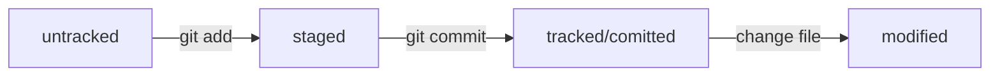

* Сделать папку репозиторием — git init
* «Разгитить» папку, если что-то пошло не так, — rm -rf .git
* Проверить состояние репозитория — git status
* Подготовить файлы к сохранению — git add
* Выполнить коммит — git commit
* Просмотреть историю коммитов — git log
* Инициализация репозитория git init

---

## SSH
~~~
$ ls -la .ssh/ # вывели список созданных ключей  
$ ssh-keygen -t ed25519 -C "электронная почта, к которой привязан ваш аккаунт на GitHub"
$ ssh-keygen -t rsa -b 4096 -C "электронная почта, к которой привязан ваш аккаунт на GitHub"
ls -a ~/.ssh # проверить, что ключи действительно сгенерировались.
~~~
 
 скопировать содержимое ключа в буфер обмена:
 ~~~
 $ clip < ~/.ssh/id_rsa.pub
 ~~~
 для ed25519:
~~~ 
$ clip < ~/.ssh/id_ed25519.pub
~~~
 Проверить правильность ключа с помощью следующей команды.
 ~~~
 $ ssh -T git@github.com
 ~~~
 
 Привязать удалённый репозиторий к локальному — git remote add
 ~~~
 $ git remote add origin git@github.com:%ИМЯ_АККАУНТА%/first-project.git 
 ~~~
 Убедиться, что репозитории связаны,
 ~~~
 git remote -v
 ~~~
 Отправить изменения на удалённый репозиторий — 
 ~~~
 git push
 ~~~
 Клонировать репозиторий — 
 ~~~
 git clone
 ~~~ 
  
## Синхронизация локального и удалённого репозиториев
~~~
* git remote add origin https://github.com/YandexPracticum/first-project.git (от англ. remote, «удалённый» + add, «добавить») — привяжи локальный репозиторий к удалённому с URL https://github.com/YandexPracticum/first-project.git;
* git remote -v (от англ. verbose, «подробный») — проверь, что репозитории действительно связались;
* git push -u origin main (от англ. push, «толкать») — в первый раз загрузи все коммиты из локального репозитория в удалённый с названием origin.
~~~

## Запуск Java-файлов на компьютере и работа с JAR

* скомпилировать исходный код в байт-код  
~~~
 javac -encoding UTF-8 HelloJdk.java
~~~
*  запустить файл с байт-кодом
~~~
java -Dfile.encoding=UTF-8 HelloJdk
~~~
* Чтобы не компилировать каждый класс по отдельности
~~~
javac -d bin -encoding UTF-8 *.java 
~~~
* Команда для запуска проекта
~~~
java -cp bin Practicum 
~~~

## Как работать с JAR

~~~
jar cfe <имя jar-файла> <имя стартового класса> <список файлов> 
jar cfe library.jar Practicum -C bin .
~~~

*  запустить программу
~~~
java -jar library.jar 
~~~

## Исследуем лог

После вызова git log появляется список коммитов с их описанием.

Вот из каких элементов состоит описание:
* Строка из цифр и латинских букв после слова commit — это уже знакомый вам хеш коммита.
* Author — имя автора и его электронная почта.
* Date — дата и время создания коммита.
* Сообщение к коммиту.
~~~
git log --oneline
~~~

Сокращённый лог вызывают командой git log с флагом --oneline (англ. «одной строкой»). При этом в терминале появятся только первые несколько символов хеша каждого коммита и комментарии к ним.

## HEAD — всему голова

Файл HEAD (англ. «голова», «головной») — один из служебных файлов папки .git. Он указывает на коммит, который сделан последним (то есть на самый новый).

## Статусы untracked/tracked, staged и modified

Одна из ключевых задач Git — отслеживать изменения файлов в репозитории. Для этого каждый файл помечается каким-либо статусом. Рассмотрим основные.
* untracked (англ. «неотслеживаемый»)

Новые файлы в Git-репозитории помечаются как untracked, то есть неотслеживаемые. Git «видит», что такой файл существует, но не следит за изменениями в нём. У untracked-файла нет предыдущих версий, зафиксированных в коммитах или через команду git add.

* staged (англ. «подготовленный»)

После выполнения команды git add файл попадает в staging area (от англ. stage — «сцена», «этап [процесса]» и area — «область»), то есть в список файлов, которые войдут в коммит. В этот момент файл находится в состоянии staged.

* tracked (англ. «отслеживаемый»)

Состояние tracked — это противоположность untracked. Оно довольно широкое по смыслу: в него попадают файлы, которые уже были зафиксированы с помощью git commit, а также файлы, которые были добавлены в staging area командой git add. То есть все файлы, в которых Git так или иначе отслеживает изменения.

* modified (англ. «изменённый»)

Состояние modified значит, что Git сравнил содержимое файла с последней сохранённой версией и нашёл отличия. Например, файл был закоммичен и после этого изменён.
Вот что ещё важно учесть:
Для файлов в состояниях staged и modified обычно не указывается, что они также tracked, потому что это состояние подразумевается.
Команда git add добавляет в staging area только текущее содержимое файла. Если вы, например, сделаете git add file.txt, а затем измените file.txt, то новое содержимое файла не будет находиться в staging. Git сообщит об этом с помощью статуса modified: файл изменён относительно той версии, которая уже в staging. Чтобы добавить в staging последнюю версию, нужно выполнить git add file.txt ещё раз.
Типичный жизненный цикл файла в Git

## Conventional Commits 

Стандарт Conventional Commits (англ. «соглашение о коммитах») отличается качественной документацией и подробной проработкой. Он подходит для репозиториев с исходным кодом программ. А вот использовать его для других типов проектов было бы неудобно.
Conventional Commits предлагает такой формат коммита: <type>: <сообщение>. Первая часть type — это тип изменений. Таких типов достаточно много. Вот два примера:
* feat (сокращение от англ. feature) — для новой функциональности;
* fix (от англ. «исправить», «устранить») — для исправленных ошибок.
Более подробный список можно увидеть на сайте с описанием этого стиля.

## Mermaid-схема

HEAD -- это голова.
Коммит -- это всему голова.
Статусы файлов:
<тут пустая строка!>

<и тут пустая строка!> 